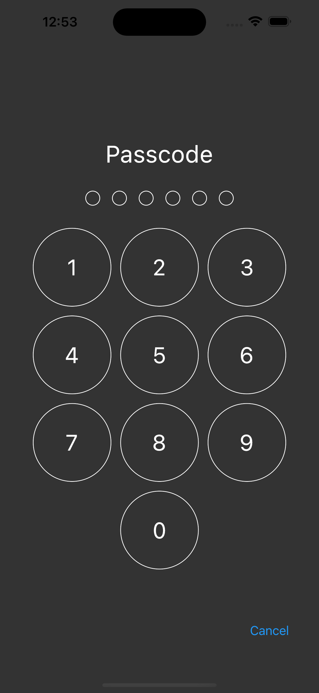

# Flutter App Lock

A Flutter app that implements showing a lock screen when an app is opened or paused.

If a user is launching the app or opening the app for the first time, a lock screen is shown.

If a user returns to the app after it has been launched, a lock screen is shown if the time the app spent in the background exceeds the lock duration.


## Screenshots

### Home and Passcode Screen

&nbsp;&nbsp;&nbsp;&nbsp;&nbsp;&nbsp;&nbsp;&nbsp;


## ✨ Requirements

- Any Operating System (ie. MacOS X, Linux, Windows)
- Any IDE with Flutter SDK installed (ie. Android Studio, VSCode, IntelliJ, etc)
- A little knowledge of Dart and Flutter

## Run Locally

```bash
  git clone https://github.com/lexican/flutter_app_lock.git
  cd flutter_app_lock
  flutter pub get
  flutter run
```
